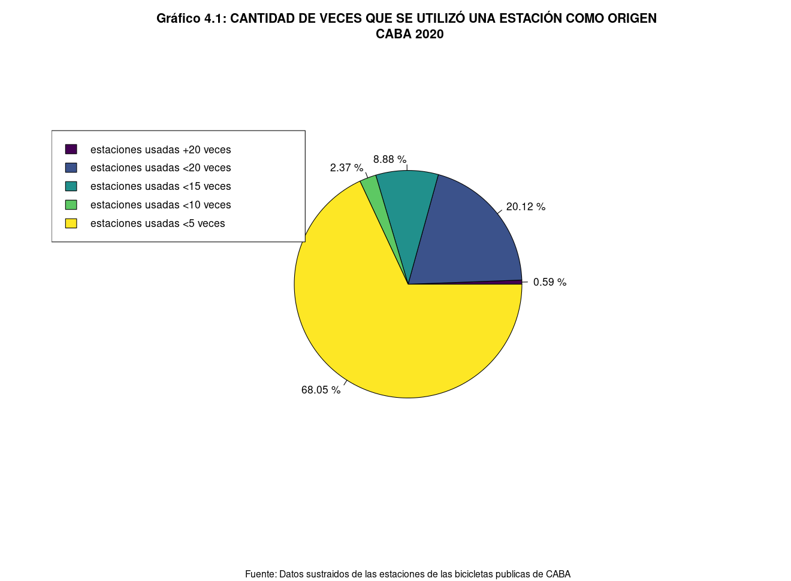
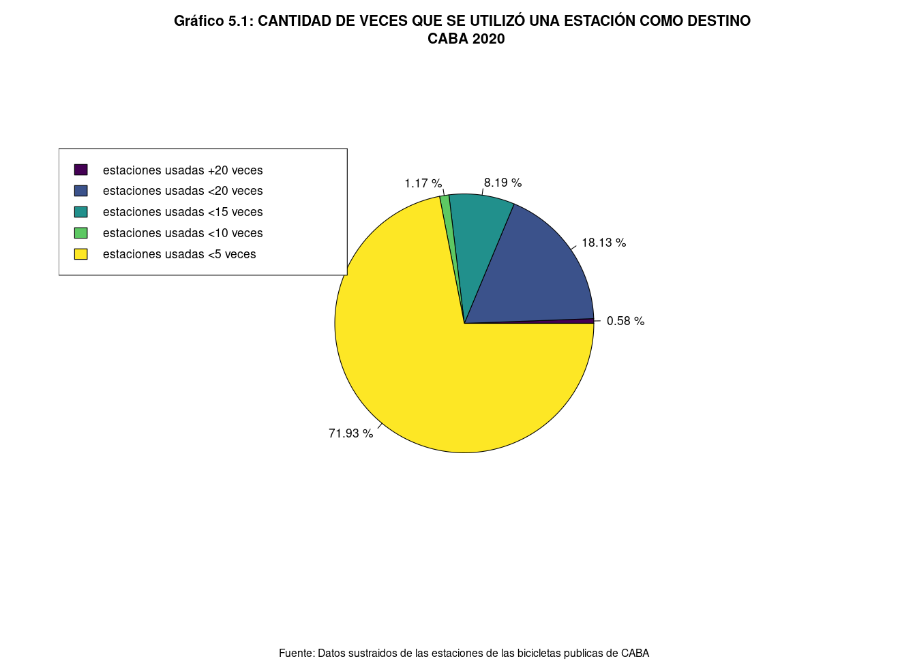

---
output:
  pdf_document: default
  toc: true
  theme: united
  html_document: default
  word_document: default
---
\setcounter{page}{1}
```{r setup, include=FALSE}
knitr::opts_chunk$set(echo = FALSE)
# Librerias
library(knitr)
library(viridis)
getwd()
# setwd("/home/silva/Documentos/ecobici-estadistica-descriptiva/")
# leemos el csv de recorridos
recorridos <- read.csv("./recorridos6.csv")
# leemos el csv de usuarios
usuarios <- read.csv("./usuarios6.csv")
# combinamos los csv
bicicletas <- merge(usuarios, recorridos, all = TRUE)
# damos un orden a los dias
dia <- factor(bicicletas$dia, levels = c("Lunes","Martes","Miércoles","Jueves", "Viernes", "Sábado", "Domingo"))
```

\vspace{-1cm}
\tableofcontents
\newpage

# **Introducción**

**Objetivo**

El objetivo del siguiente informe es mostrar estadisticamente el uso de las ecobicis de la Ciudad Autónoma de Buenos Aires. Además de brindar datos y gráficos (univariados y bivariados) para tener una apreciación de la utilidad de las bicicletas y del comportamiento de los usuarios. Se muestran falencias y posibles mejoras al sistema.

**Sobre las muestras**

Se utilizaron dos datasets.
El primero es sobre los usuarios que utilizaron el sistema. Es de tamaño 200 y brinda el género y la edad de cada uno. También identifica a cada uno con un id.

El segundo es sobre los recorridos. Este es de tamaño 811. Dice la estación donde se originó y concluyó, la duración, la distancia y el día en el que se efectuó. Además de decir qué id de usuario realizó cada viaje.

\newpage

# **Análisis univariado**

## **Variable género** (Gráfico de Sectores)

Es una variable cualitativa cuyos valores posibles son:
 Masculino, Femenino y Otro.
En este caso, la unidad de análisis son los usuarios.
El grafico pasa a representar el género de los usuarios que han utilizado las ecobici.


``` {r genero, fig.align='center', out.width = "50%"}

gen <- table(usuarios$genero_usuario)[2:4]
frecRel <- gen/sum(gen)
frecAbsAcum <- cumsum(gen)
frecRelAcum <- cumsum(frecRel)
frecRel <- round(frecRel, digits = 4)
frecRelAcum <- round(frecRelAcum, digits = 4)
tabla <- cbind(c("Femenino", "Masculino", "Otro"),gen,frecRel,frecAbsAcum,frecRelAcum)
names = c("Genero", "Frecuencia absoluta","Frecuencia relativa","Frecuencia absoluta acumulada",
          "Frecuencia relativa acumulada")
kable(tabla, caption = "Tabla de frecuencias", col.names = names, row.names = FALSE, align = c('l','r','r','r','r','r','r','r'))

genero <- table(usuarios$genero_usuario)[2:4]

label <- c("Femenino","Masculino","\nOtro")
porcentajes <- round((genero/sum(genero))*100, digits = 2)
label <- paste(label,porcentajes,"%")
color <- c("#FFC09F","#A0CED9","#FFEE93")
  
pie(
  genero,
  main = "Grafico 1: GENERO DE LOS USUARIOS DE ECOBICI \n CABA 2020",
  labels = label,
  sub="Fuente: Datos sustraidos de las estaciones de las bicicletas publicas de CABA",
  cex.sub = 0.9,
  col = color
)

#var(genero) #Variancia de Genero 151

```

En el Gráfico 1 se puede apreciar que un gran porcentaje de usuarios de las Ecobicis son de género "Femenino", más que aquellos que pertenecen al "Masculino".
Sobre el genero "Otro" no se puede tener demasiada apreciación debido a que el término es muy 
abarcativo.
Es interesante notar que si éste último fuera la categoría por defecto, y quienes dieron sus datos no la cambiaron siendo de géneros "Masculino" o "Femenino", al obtener un porcentaje tan alto es posible que en caso de registrarse correctamente cambien las conclusiones.


*Medida de interés:*

- Moda : Femenino

## **Variable edad** (Histograma)

Es una variable cuantitativa continua cuyos valores están entre 16 y 72.
Representa la edad de los usuarios de ecobici.
En este caso, la unidad de análisis son los usuarios.

``` {r edad, fig.align = 'center', out.width = "70%"}
edad <- usuarios$edad_usuario
breakpoints <- c(15,20,25,30,35,40,45,50,55,60,72)

# Histograma

hist(edad,breaks = breakpoints, right = TRUE,
     xlim = c(10,80), ylim = c(0,0.05), xlab = "Edad", ylab = "Densidad",
     main = "Grafico 2: EDAD DE LOS USUARIOS DE ECOBICI\nCABA 2020",
     sub="Fuente: Datos sustraidos de las estaciones de las bicicletas publicas de CABA",
     cex.sub = 0.9,
     col = "lightblue")

```

Los datos resultan en un histograma unimodal asimétrico a derecha.

``` {r polig, figures-side, out.width = "50%"}
edad <- usuarios$edad_usuario
rng_edad <- cut(edad, breakpoints, right = TRUE)
tabla_rng_edad <- table(rng_edad)
n <- sum(tabla_rng_edad)

# Poligono de frecuencias
x <- breakpoints
y <- c(0,tabla_rng_edad)/n
plot(x,y,type="l", xlim = c(15,72), ylim = c(0,0.25),
     main = "Grafico 2.1: EDAD DE LOS USUARIOS DE ECOBICI\nCABA 2020",
     sub="Fuente: Datos sustraidos de las estaciones de las bicicletas publicas de CABA",
     cex.sub = 0.9,
     ylab = "Frecuencia relativa", xlab = "Edad",lwd = 1.5)
for (i in seq(0,0.25,by=0.05)) abline(a=i,b=0,lty=2,lwd=0.5)


# Poligono acumulativo
y = cumsum(y)
plot(x,y,type="l", xlim = c(15,72), 
     main = "Grafico 2.2: EDAD DE LOS USUARIOS DE ECOBICI\nCABA 2020",
     sub="Fuente: Datos sustraidos de las estaciones de las bicicletas publicas de CABA",
     cex.sub = 0.9,
     ylab = "Frecuencia relativa acumulada", xlab = "Edad", lwd = 1.5)
for (i in seq(0,1,by=0.2)) abline(a=i,b=0,lty=2,lwd=0.5)

# var(edad) # Variancia de Edad
```

En el Gráfico 2 se muestra la variación del uso del servicio respecto de la
edad de los usuarios.
En el Gráfico 2.1 y 2.2, se muestran los polígonos de Frecuencias Relativas y
Absolutas de los usuarios respecto de la edad de los mismos.

En el Gráfico 2.1, se puede ver claramente el aumento del uso de las ecobici,
de manera creciente entre los usuarios cuyas edades van desde 20 a 30 
años y luego va decreciendo a medida que aumenta la edad de los mismos.
En otras palabras los usuarios con edad en el rango [20,35] son los que mas 
utilizan el servicio, que aquellos usuarios mayores.

Complementariamente, definimos una variable "Grupo etario" cualitativa cuyos valores posibles son:
Adulto menor, de 16 a 25 años.
Adulto medio, de 26 a 45 años.
Adulto mayor, de +45 años

``` {r etario}
edad <- usuarios$edad_usuario

agrupar <- function(x){
  if (x <= 25) {
    return ("Adulto menor")
  } else if(x <= 45) {
    return ("Adulto medio")
  } else {
    return ("Adulto mayor")
  }
}

etario <- sapply(edad,agrupar)

frecAbs <- table(etario)
frecRel <- frecAbs/sum(frecAbs)
frecAbsAcum <- cumsum(frecAbs)
frecRelAcum <- cumsum(frecRel)
frecRel <- round(frecRel, digits = 4)
frecRelAcum <- round(frecRelAcum, digits = 4)

tabla <- cbind(names(frecAbs),frecAbs,frecRel,frecAbsAcum,frecRelAcum)
names = c("Grupo etario", "Frecuencia absoluta","Frecuencia relativa","Frecuencia absoluta acumulada",
          "Frecuencia relativa acumulada")
kable(tabla, caption = "Tabla de frecuencias", col.names = names, row.names = FALSE, align = c('l','r','r','r','r'))
```
En la tabla se observa que la mayoría de usuarios son "Adultos medios" (alrededor del 60% de los 200 totales).


*Medidas de interés:*

- Mínimo: 16 años
- Mediana: 30 años
- Media: 31.97 años
- Desvío estandar: 9.89 años (desviación "típica" de la media)
- Moda: 22 años
- Máximo: 72 años

## **Variable días** (Tabla de Frecuencias más Gráfico de Barras)

Es una variable cualitativa que representa los días en que se efectuaron los viajes.
En este caso, la unidad de análisis son los recorridos.

``` {r dias, fig.align='center', out.width = "70%"}
semana <- table(dia)
frecRel <- semana/sum(semana)
frecAbsAcum <- cumsum(semana)
frecRelAcum <- cumsum(frecRel)
frecRel <- round(frecRel, digits = 4)
frecRelAcum <- round(frecRelAcum, digits = 4)
tabla <- cbind(names(semana),semana,frecRel,frecAbsAcum,frecRelAcum)
names = c("Estación", "Frecuencia absoluta","Frecuencia relativa","Frecuencia absoluta acumulada",
          "Frecuencia relativa acumulada")
kable(tabla, caption = "Tabla de frecuencias", col.names = names, row.names = FALSE, align = c('l','r','r','r','r','r','r','r'))

barplot(semana, main = "Grafico 3: DIA DE LOS RECORRIDOS DE LAS ECOBICI\n CABA 2020",
        sub="Fuente: Datos sustraidos de las estaciones de las bicicletas publicas de CABA",
        cex.sub = 0.9,
        cex.main = 0.9,
        cex.names = 0.8,
        ylab = "Cantiadad de viajes",
        ylim = c(0,150), col = c("lightblue"))
```

En el Gráfico 3 se puede observar que durante todo el año 2020 se efectuaron
mas viajes los dias Viernes que en el resto de la semana. 
Se puede suponer que ese día se efectúan dicha
cantidad de viajes, debido a que es el último día laboral de la semana
y la mayoría de los usuarios opta por este servicio para poder regresar a 
sus casas a tiempo.

*Medida de interés:*

- Moda: Viernes

## **Variable estación de origen** (Tabla de Frecuencias más Gráfico de Barras)

Es una variable cualitativa. Representa a las estaciones donde se originaron los viajes.

Se representan las estaciones más utilizadas, debido a la gran cantidad de estaciones de origen.
Hay 169 estaciones donde se iniciaron viajes, en total.

En este caso, la unidad de análisis son los recorridos.

``` {r estorigen, fig.align='center', out.width = "90%"}
frecAbs <- table(bicicletas$direccion_estacion_origen)
frecAbs <- sort(frecAbs, decreasing = TRUE)
#frecAbs <- frecAbs[1:15]
frecRel <- frecAbs/sum(frecAbs)
frecAbsAcum <- cumsum(frecAbs)
frecRelAcum <- cumsum(frecRel)
frecRel <- round(frecRel, digits = 4)
frecRelAcum <- round(frecRelAcum, digits = 4)

tabla <- cbind(names(frecAbs),frecAbs,frecRel,frecAbsAcum,frecRelAcum)
names = c("Estación", "Frecuencia absoluta","Frecuencia relativa","Frecuencia absoluta acumulada",
          "Frecuencia relativa acumulada")
kable(tabla[1:15,], caption = "Tabla de frecuencias", col.names = names, row.names = FALSE, align = c('l',rep('r',15)))

par(mar = c(6,13,4,4))
barplot(
  sort(frecAbs[1:15], decreasing = FALSE),
  main = "Grafico 4: ESTACIONES DE ORIGEN MAS USADAS \n DE LAS ECOBICI, CABA 2020",
  sub="Fuente: Datos sustraidos de las estaciones de las bicicletas publicas de CABA",
  cex.sub = 0.7,
  cex.main = 0.8,
  cex.lab = 0.8,
  cex.axis = 0.9,
  horiz = TRUE,
  las = 1,
  xlim = c(0,25),
  xlab = "Cantidad de viajes",
  cex.names = 0.6,
  col = "lightblue",
)
par(mar = c(5,4,4,2) + 0.1)
```

Se puede ver a partir de la tabla que alrededor del 27% de los viajes se originaron en sólo 15 de las 169 estaciones.

*Medida de interés:*

- Moda: Cevallos, Virrey & Yrigoyen, Hipolito Av.

Complementariamente, se pueden definir categorías para la variable anterior, de manera de poder visualizar cuántas estaciones no se utilizaron tanto.

```{r out.width = "90%", fig.align = "center"}

```

Del gráfico 4.1 se puede ver que alrededor del 68% de las estaciones fueron utilizadas menos de 5 veces. En otras palabras, la mayoría de las estaciones de origen fueron utilizadas relativamente poco, mientras que alrededor de un tercio de ellas fueron las que se usaron repetidas veces.

## **Variable estación de Destino** (Tabla de Frecuencias más Gráfico de Barras)

Es una variable cualitativa. Representa a las estaciones de destino de cada viaje.

Se representan las estaciones más utilizadas, debido a la gran cantidad de estaciones de destino.
Hay 171 estaciones donde se concluyeron viajes, en total.

En este caso, la unidad de análisis son los recorridos.

``` {r estdestino, fig.align='center', out.width = "90%"}
frecAbs <- table(bicicletas$direccion_estacion_destino)
frecAbs <- sort(frecAbs, decreasing = TRUE)
#frecAbs <- frecAbs[1:15]
frecRel <- frecAbs/sum(frecAbs)
frecAbsAcum <- cumsum(frecAbs)
frecRelAcum <- cumsum(frecRel)
frecRel <- round(frecRel, digits = 4)
frecRelAcum <- round(frecRelAcum, digits = 4)

tabla <- cbind(names(frecAbs),frecAbs,frecRel,frecAbsAcum,frecRelAcum)
names = c("Estación", "Frecuencia absoluta","Frecuencia relativa","Frecuencia absoluta acumulada",
          "Frecuencia relativa acumulada")
kable(tabla[1:15,], caption = "Tabla de frecuencias", col.names = names, row.names = FALSE, align = c('l',rep('r',15)))

par(mar = c(6,14,4,4))
barplot(
  sort(frecAbs[1:15], decreasing = FALSE),
  main = "Grafico 5: ESTACIONES DESTINO MAS USADAS \n DE LAS ECOBICI, CABA 2020",
  sub="Fuente: Datos sustraidos de las estaciones de las bicicletas publicas de CABA",
  cex.sub = 0.7,
  cex.main = 0.8,
  cex.lab = 0.8,
  cex.axis = 0.9,
  horiz = TRUE,
  las = 1,
  xlim = c(0,25),
  xlab = "Cantidad de viajes",
  cex.names = 0.6,
  col = "lightblue",
)
par(mar = c(5, 4, 4, 2) + 0.1)
```

Se puede ver a partir de la tabla que, alrededor de 26% de los viajes tuvieron como destino
sólo 15 de las 171 estaciones.

*Medida de interés:*

- Moda: Lavalle & Acuña De Figueroa, Francisco

Complementariamente, se pueden definir categorías para la variable anterior, de manera de poder visualizar cuántas estaciones no se utilizaron tanto.

```{r out.width = "90%", fig.align = "center"}

```

Del gráfico 5.1 se puede ver que alrededor del 72% de las estaciones fueron utilizadas menos de 5 veces. En otras palabras, la mayoría de las estaciones de origen fueron utilizadas relativamente poco, mientras que alrededor de un tercio de ellas fueron las que se usaron repetidas veces.

## **Variable distancia**

Es una variable cuantitativa continua.
Sus valores están entre 0 y 20 km.
Cualquier apreciación mayor a 20 km es considerada un error de sistema o humano y por lo tanto no es tenida en cuenta en el análisis.

En este caso, la unidad de análisis son los recorridos.


``` {r distancia, fig.align='center', out.width = "70%"}
distancia <- bicicletas$distancia/1000
distancia <- distancia[distancia<20]
boxplot(distancia, horizontal = TRUE, outline = TRUE,
        main = "Grafico 6: DISTANCIA DE LOS RECORRIDOS \n DE ECOBICI, CABA 2020",
        sub="Fuente: Datos sustraidos de las estaciones de las bicicletas publicas de CABA",
        cex.sub = 0.9,
        cex.main = 0.9,
        xlab = "Distancia en kilometros", boxfill = "lightblue")
```

En el Gráfico 6 se puede ver que:

El 25% recorrió menos de 2.83 km.

El 50% recorrió menos de 4.36 km.

El 75% recorrió menos de 6.21 km.

*Medidas de interés:*

- Mínimo: 0.70 km
- Mediana: 4.36 km
- Media: 4.96 km
- Desvío estandar: 3.06 km (desviación "típica" de la media de 3.06 km)
- Máximo: 18.30 km (outlier)

## **Variable duración**

Es una variable cuantitativa continua.
Sus valores están entre 4 min y 90 min.
Cualquier apreciación mayor a 90 minutos es considerada un error de sistema o humano y por lo tanto no es tenida en cuenta en el análisis.

En este caso, la unidad de análisis son los recorridos.


``` {r duración, fig.align='center', out.width = "70%"}
duracion <- bicicletas$duracion_recorrido/60
duracion <- duracion[duracion<90]
boxplot(duracion, horizontal = TRUE, outline = FALSE,
        main = "Grafico 7: DURACION DE LOS RECORRIDOS \n DE ECOBICI, CABA 2020",
        sub="Fuente: Datos sustraidos de las estaciones de las bicicletas publicas de CABA",
        cex.sub = 0.9,
        cex.main = 0.9,
        xlab = "Duración en minutos", boxfill = "lightblue")
```

A partir del Gráfico 7 se puede ver que:

El 25% de los usuarios utilizó el servicio menos de 13 min

El 50% de los usuarios utilizó el servicio menos de 21 min

El 75% de los usuarios utilizó el servicio menos de 30 min

Es interesante notar que un 25% de los viajes se excedieron del tiempo límite de 30 minutos.

*Medidas de interés:*

- Mínimo: 4.05 min
- Mediana: 21.35 min
- Media: 23.84 min
- Desvío estandar: 14.18 min (desviación "típica" de la media de 14.18 minutos)
- Máximo: 87.37 min (outlier)

## **Variable cantidad de viajes por usuario**

Es una variable cuantitativa discreta, cuyos valores posibles estan entre 1 y 32 viajes.

En este caso, la unidad de análisis son los usuarios.

``` {r viajes, fig.align='center', out.width = "70%"}
viajes <- table(bicicletas$id_usuario)

plot(table(viajes), 
     main = "Grafico 8: CANTIDAD DE VIAJES POR USUARIO\nCABA 2020",
     sub="Fuente: Datos sustraidos de las estaciones de las bicicletas publicas de CABA",
     cex.sub = 0.9,
     ylim = c(0,100), xlab = c("Cantidad de Viajes") ,ylab = c("Cantidad de Usuarios"))

n <- sum(table(viajes))
v <- table(viajes)
v <- append(v,c(0,0,0,0),after =16)
v <- append(v,c(0,0),after = 21)
v <- append(v,0,after=25)
v <- append(v,c(0,0,0,0),after=27)

titulo <- "Grafico 9: FRECUENCIA RELATIVA ACUMULADA DE LA\n CANTIDAD DE VIAJES POR USUARIO\nCABA 2020"
plot(c(0,cumsum(v))/n, type = "s",xlim=c(0,32), main = titulo,
     cex.main = 0.9,
     sub = "Fuente: Datos sustraidos de las estaciones de las bicicletas publicas de CABA",
     cex.sub = 0.9, ylab = "Frecuencia relativa acumulada", xlab = "Cantidad de viajes",lwd=1.5)
for (i in seq(0,1,by=0.2)) abline(a=i,b=0,lty=2,lwd=0.5)
```

A partir del gráfico 8 de bastones se puede ver que:

96 Usuarios realizaron un solo viaje.

Solamente 2 usuarios realizaron 32 viajes.

Del gráfico 9 se concluye que alrededor del 50% de usuarios realizaron sólo 1 viaje.

*Medida de interes:*

- Moda: 1 viaje

\newpage

# **Análisis bivariado**

Se realiza un análisis de las variables (cuantitativas continuas) edad y distancia recorrida.
Se divide la edad a partir de 4 rangos etarios por lo que se transforma en una variable cualitativa.

En este caso, la unidad de análisis son los recorridos (por la distancia) y los usuarios (por la edad).

``` {r bivar, fig.align='center', out.width = "70%"}
edad <- bicicletas$edad_usuario

agrupar <- function(x){
  if (x <= 21) {
    return ("[16-21]")
  } else if(x <= 30) {
    return ("[22-30]")
  } else if(x <= 45){
    return ("[30-45]")
  } else if(x <= 72){
    return("[45-72]")
  }
}

edad <- sapply(edad,agrupar)


distancia <- bicicletas$duracion/60

bivar <- data.frame(edad,distancia)

bivar$edad <- factor(bivar$edad, levels = c("[16-21]","[22-30]","[30-45]","[45-72]"))

par(mar = c(6,8,4,4))
boxplot((bivar$distancia)~(bivar$edad), horizontal = TRUE, outline = FALSE,
        main = "Grafico 10: DURACION DEL RECORRIDO SEGUN \n LA EDAD DEL USUARIO, CABA 2020",
        sub="Fuente: Datos sustraidos de las estaciones de las bicicletas publicas de CABA",
        cex.sub = 0.9,
        las = 1,
        ylab = "",
        names = c("De 16 a 21 años", "De 22 a 30 años","De 31 a 45 años", "De 46 a 72 años"),
        xlab = "Duración en minutos", boxfill = "lightblue")
```

El rango de la variable en el grupo de 46 a 72 años es el más extenso y tiene el mayor máximo.

Se podría creer que una posible explicación sería que la gente mayor no acredita correctamente el fin de sus viajes.

A medida que avanzan las edades se puede ver que cada vez más gente se acerca e incluso sobrepasa el límite de 30 minutos.
Siendo el grupo etario de 16 a 21 años es el que más respeta el tiempo límite. Y el grupo de 46 a 72 años es el que más lo excede.

\newpage

# **Conclusiones**

A partir de los datos analizados se pueden sacar las siguientes conlcusiones:

**Quiénes usan las bicicletas:**

Los usuarios del servicio de bicicletas suelen ser gente de entre 20 y 40 años, de ambos géneros aunque hay apenas más del género "Femenino" que del resto.

**Cuándo y dónde se usan:**

El uso de las mismas no fluctua demasiado durante la semana pero si hay una diferencia grande en el uso de las estaciones. En unas pocas se realizaron una gran cantidad de los viajes, lo que indicaría que allí sería conveniente poner más bicicletas que en el resto de ellas.

**Cómo se utilizan:**

Por último es interesante notar que hay muchos viajes que son largos tanto en distancia como en duración. Esto podría indicar que dentro de los usuarios no se conoce bien el funcionamiento del servicio y por ello se pasan del tiempo permitido de 30 minutos o no acreditan bien los viajes al finalizarlos. Además, se pudo ver que los usuarios de mayor edad son los que más se excedieron en este aspecto.